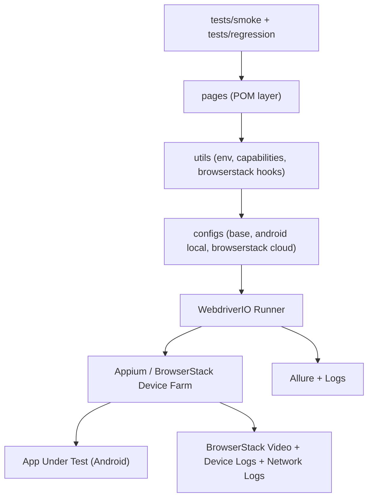
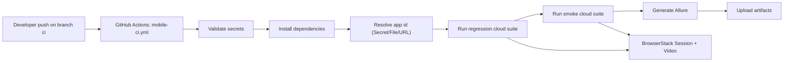

# Mobile QA Architecture and CI/CD Flow

## Architecture flow

## CI/CD flow

## Technical layers
1. `tests/`: business intent and acceptance rules (smoke and regression separation).
2. `pages/`: UI contracts encapsulated with resilient selectors.
3. `utils/`: cross-cutting concerns (env management, capabilities, cloud status integration).
4. `configs/`: runtime orchestration and platform/environment decoupling.
5. `workflow`: CI governance, cloud provisioning, evidence pipeline.

## Long-term quality strategy
- Minimize flakiness with stable selectors and synchronized waits.
- Keep tests deterministic with isolated suites and explicit env validation.
- Standardize evidence to speed up triage and root-cause analysis.
- Scale by adding capability matrix and parallel execution in cloud.
